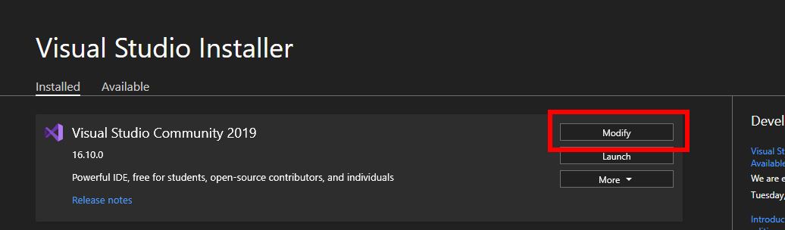
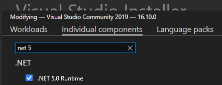
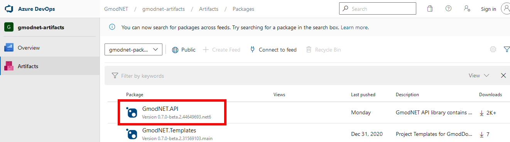
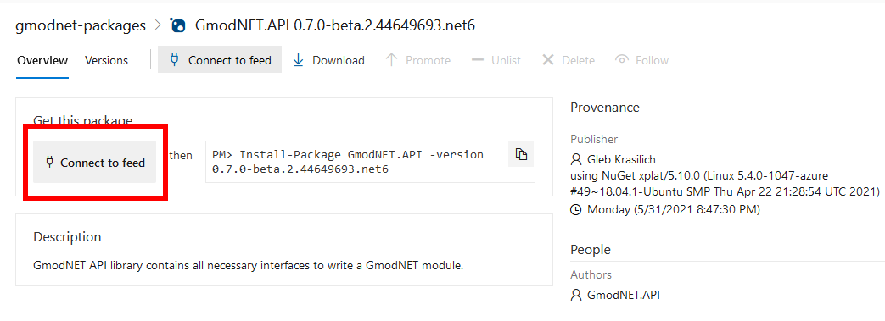
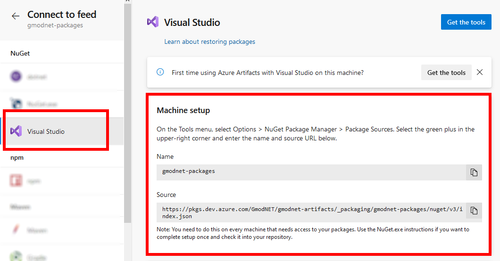
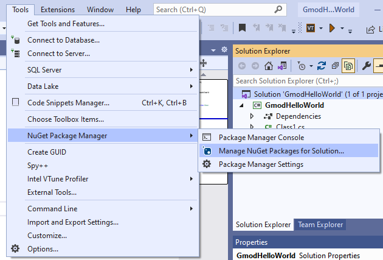
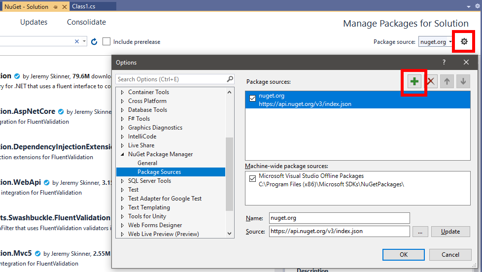
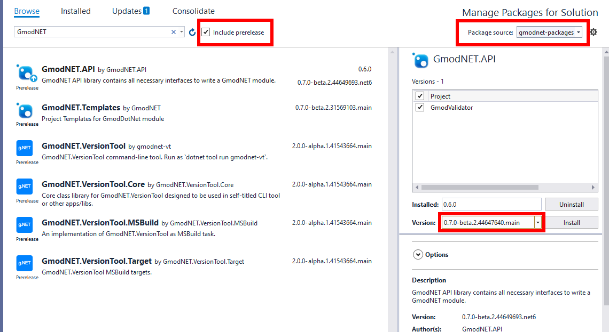
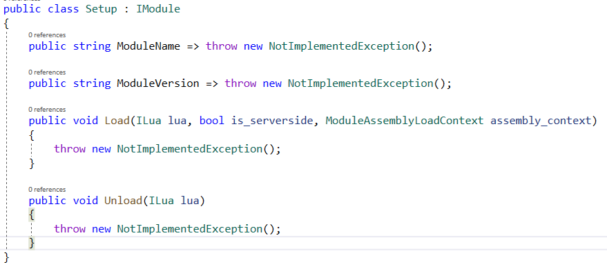

> [!WARNING]
> The nightly builds can be unstable. Please help us find bugs by [reporting issues on GitHub](https://github.com/GmodNET/GmodDotNet/issues).

# Connect to the nightly builds and use it in your project
Connect to the latest version of Gmod.NET to use the newest features and work with the `.NET 5.0`.

We'll create a project to test if we've got the latest version.

## Requirements

* [Visual Studio 2019](https://visualstudio.microsoft.com/)
   * Ensure at least these individual components are installed:
      * .NET SDK
      * NuGet Package manager
* Windows 10 (For more see the [Visual Studio requirements](https://docs.microsoft.com/en-us/visualstudio/releases/2019/system-requirements#visual-studio-2019-system-requirements))
* An internet connection

## Preparations

The current nightly builds require at least .NET 5.0.

**Install the `.NET 5.0 Runtime` component for Visual Studio 2019:**
* Start the Visual Studio Installer through `[Start Menu] > [All Programs] > Visual Studio 2019 > Visual Studio Installer`
* Modify your installation:

* Go to Individual Components
* Search for `.NET 5.0 Runtime`

* Click Modify in the bottom right

## Start a .NET 5.0 project

To test if we've got a working nightly version we'll create a test project.

1. Start Visual Studio 2019
2. Create a new project and solution
3. When asked to pick a framework choose `.NET 5.0`

## Adding the nightly builds to NuGet

1. In the [Gmod.NET README](https://github.com/GmodNET/GmodDotNet#nightly-builds) there is [a link to the nightly builds](https://dev.azure.com/GmodNET/gmodnet-artifacts/_packaging?_a=feed&feed=gmodnet-packages)
2. Click *GmodNET.API*:

3. Click *Connect to feed*:

4. Note the *Source* link and name from the instructions:

5. In Visual Studio open the NuGet Package Manager:

6. Click the cog-wheel at the top right behind the default package source:

7. Click the green plus and enter the *Name* and *Source* you found at the nightly feed instructions (step 4).
8. Close these settings with OK.
9. Now select the newly added package source:

10. Ensure *Include prerelease* is selected
11. Click GmodNET.API and install the version you'd like to use.

**Currently the .main branch uses .NET 5.0.**

## Test installation

1. Implement the IModule interface. (Add `: IModule` behind the class name)
    * **Note** you can have Visual Studio implement the interface through the *See potential fixes* option that appears when you hover over the IModule error.
2. Check the code generates to this result:

3. Build the project. If you get no errors you followed the instructions correctly and can now use the nightly builds.