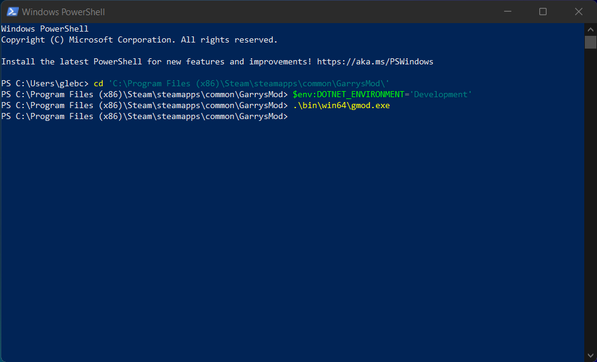
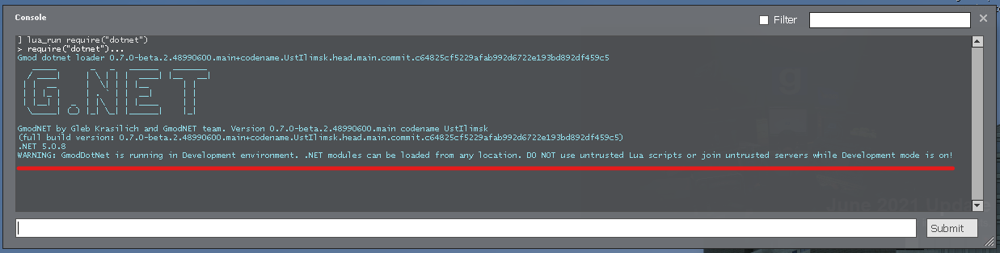
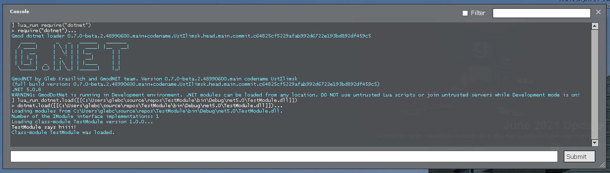
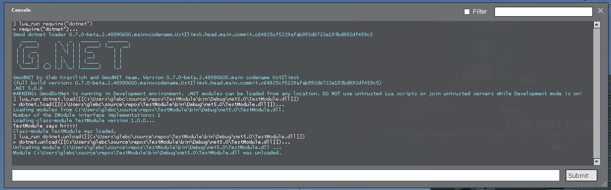
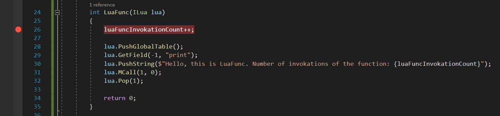
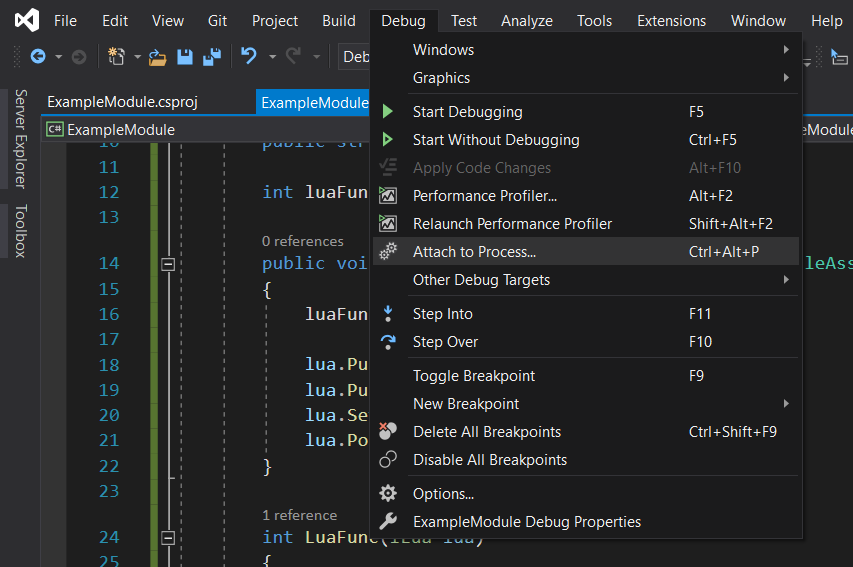
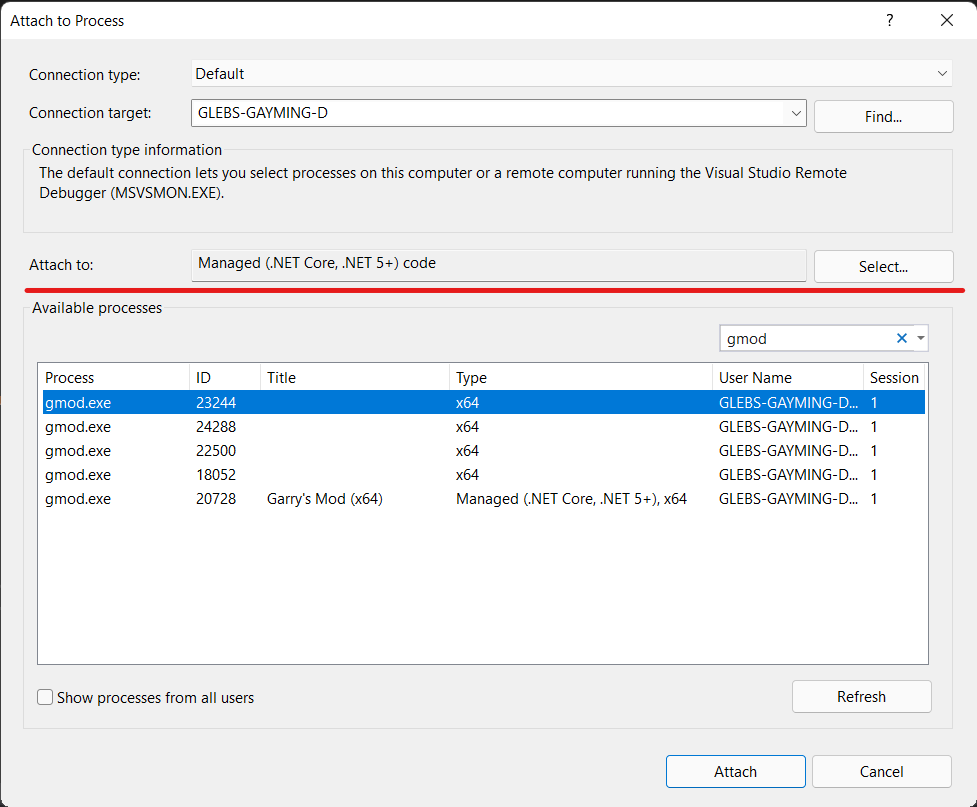
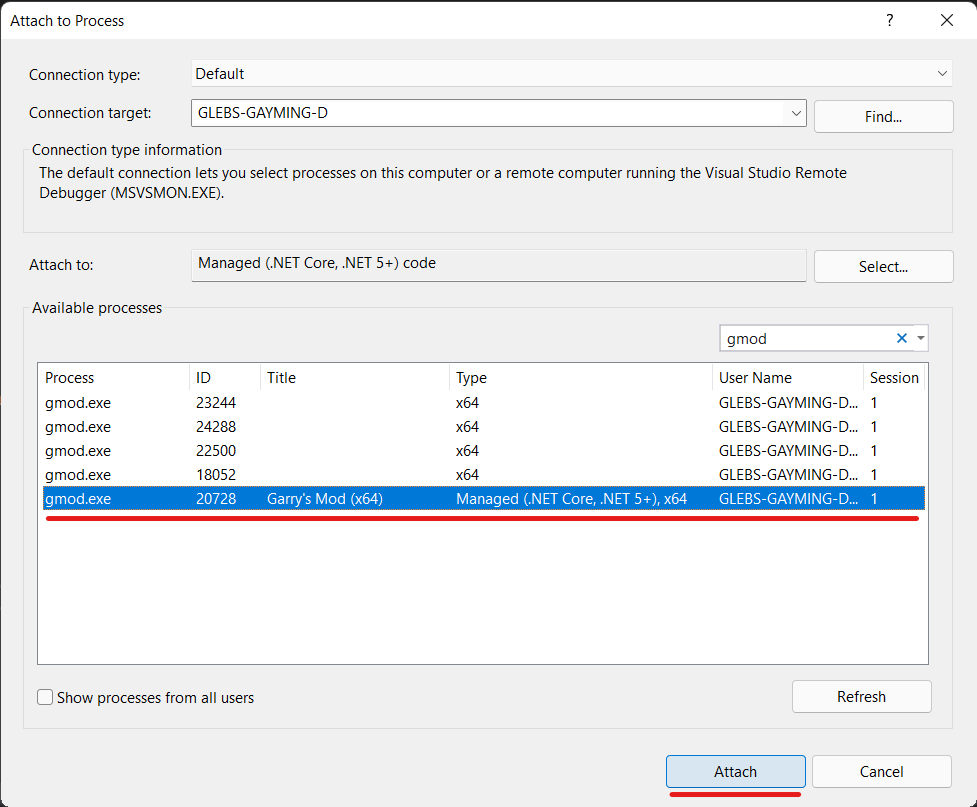
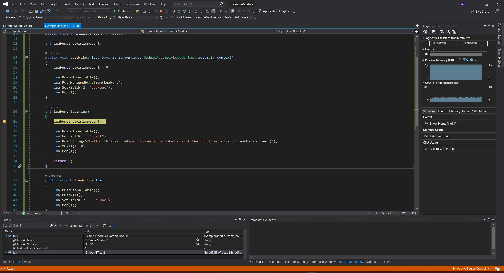
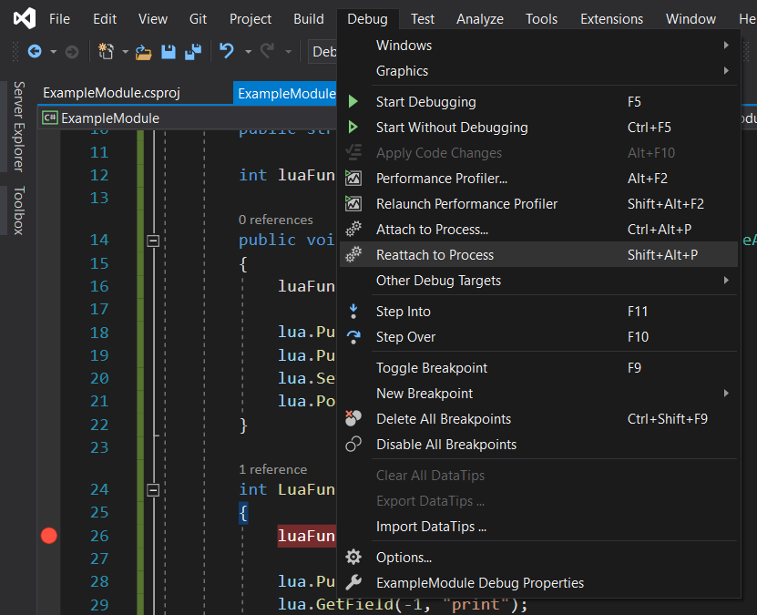

# Debugging and inner dev loop

Development, debugging, and testing of the Gmod.NET module can be a long complex process. This tutorial will teach you how to improve your inner dev loop experience by skipping coping of build artifacts and use .NET debuggers with Gmod.NET.

## Development environment

While module development, copying build artifacts to `garrysmod/lua/bin/Modules/ModuleName` after each code update may be inefficient and irritating. To address this issue, Gmod.NET Runtime introduced a feature called [Development environment](xref:runtime_features_development_environment). While Development environment is on, Gmod.NET Runtime can load modules from any location on computer by its absolute path. For example, one can load modules directly from the output directory of the C# project. (Note that module still have to be accompined by its `.deps.json` file in order for runtime to resolve dependencies, .NET SDK will automatically generate this file for you for every build.)

Since Gmod.NET modules are loaded via Lua scripts, enabling Development environment by default could cause additional security risks, especially in the case of client with Gmod.NET Runtime joining an untrusted server. Thus, Development environment should be explicitly enabled by users by setting `DOTNET_ENVIRONMENT` environment variable value to `Development` for game or dedicated server process.

Here is how you can enable and use Development environment on Windows:

1. One of the most convenient way to enable Development environment is to use command line interface. We will be using Windows PowerShell.

2. Open PowerShell window. Navigate to Garry's Mod root folder by using `cd` command (like `cd 'C:\Program Files (x86)\Steam\steamapps\common\GarrysMod\'`). Set environment variable by `$env:DOTNET_ENVIRONMENT='Development'` command (note that this is a PowerShell specific syntax for setting environment variables, if you are using other command line shell, like bash on Linux, use corresponding syntax instead). Start Garry's Mod by `.\bin\win64\gmod.exe` command.
[](images/powershell.png)

3. In started Garry's Mod instance, start a new game and load Gmod.NET (by running `lua_run require("dotnet")` in game console, for example). Gmod.NET will inform you that it is running in Development environment by printing a warning message to the game console:
[](images/gmod1.png)

4. Now we can load module by its absolute path, something like `lua_run dotnet.load([[C:\Users\glebc\source\repos\TestModule\bin\Debug\net5.0\TestModule.dll]])`.
[](images/gmod2.png)

5. To unload module, which which was loaded by absolute path, one should also use module's full path, like `lua_run dotnet.unload([[C:\Users\glebc\source\repos\TestModule\bin\Debug\net5.0\TestModule.dll]])`.
[](images/gmod3.png)

## Debugging Gmod.NET modules

Gmod.NET ships with full-featured .NET runtime by Microsoft. In particular, it means that one can use all kinds of .NET debuggers, including debuggers shipped with Visual Studio, Visual Studio for Mac, Visual Studio Code, and JetBrains Rider, or diagnostics tools while development. Here is an instruction on how you can use Visual Studio 2019 on Windows to debug your Gmod.NET module.

1. Start Garry's Mod in [Development environment](#development-environment).

2. Open your module's project in Visual Studio. For the sake of this tutorial we will be working with module named `ExampleModule` with the single source file `ExampleModule.cs`:
```csharp
using System;
using GmodNET.API;

namespace ExampleModule
{
    public class ExampleModule : IModule
    {
        public string ModuleName => nameof(ExampleModule);

        public string ModuleVersion => "1.0.0";

        int luaFuncInvokationCount;

        public void Load(ILua lua, bool is_serverside, ModuleAssemblyLoadContext assembly_context)
        {
            luaFuncInvokationCount = 0;

            lua.PushGlobalTable();
            lua.PushManagedFunction(LuaFunc);
            lua.SetField(-2, "LuaFunc");
            lua.Pop(1);
        }

        int LuaFunc(ILua lua)
        {
            luaFuncInvokationCount++;

            lua.PushGlobalTable();
            lua.GetField(-1, "print");
            lua.PushString($"Hello, this is LuaFunc. Number of invokations of the function: {luaFuncInvokationCount}");
            lua.MCall(1, 0);
            lua.Pop(1);

            return 0;
        }

        public void Unload(ILua lua)
        {
            lua.PushGlobalTable();
            lua.PushNil();
            lua.SetField(-2, "LuaFunc");
            lua.Pop(1);
        }
    }
}
```
This module adds global Lua function `LuaFunc` which greets user and says how many times it was called.

3. Add a breaking point somewhere in your code. We will add one at line 26, where `luaFuncInvokationCount`field is incremented.
[](images/vs1.png)

4. Build your module in `Debug` configuration. In such configuration, additional information for debugger will be generated and no optimizations applied.

5. Load Gmod.NET Runtime in game, do not load your module yet.

6. In Visual Studio in the top context menu navigate to `Debug > Attach to Process...`
[](images/vs2.png)

7. In the opened window, set debug type to `Managed (.NET Core, .NET 5+) code`.
[](images/vs3.png)

8. Select `gmod.exe` process which has type `Managed (.NET Core, .NET 5+) code` in the list and press `Attach`.
[](images/vs4.png)

9. Immediately after attaching debugger the breaking point may be marked as inactive due to Visual Studio's inability to locate debug symbols. It is OK, since our module (and thus its symbols) is not loaded yet.

10. Load module and invoke `LuaFunc`. The breakpoint will be hit and game process paused. From this point you can debug your module as any other .NET application. For example, you can explore and edit current values of variables.
[](images/vs5.png)

11. If you want to update your code, unload your module, stop debugging in Visual Studio, make changes, build your updated module, load it with Gmod.NET Runtime, and reattach Visual Studio debugger by using `Debug > Reattach to Process` option in the Visual Studio top context menu.
[](images/vs6.png)
Debugger have to be reattached in order to make changes visible, otherwise Visual Studio will keep outdated symbols and breakpoints in the updated code won't be hit.