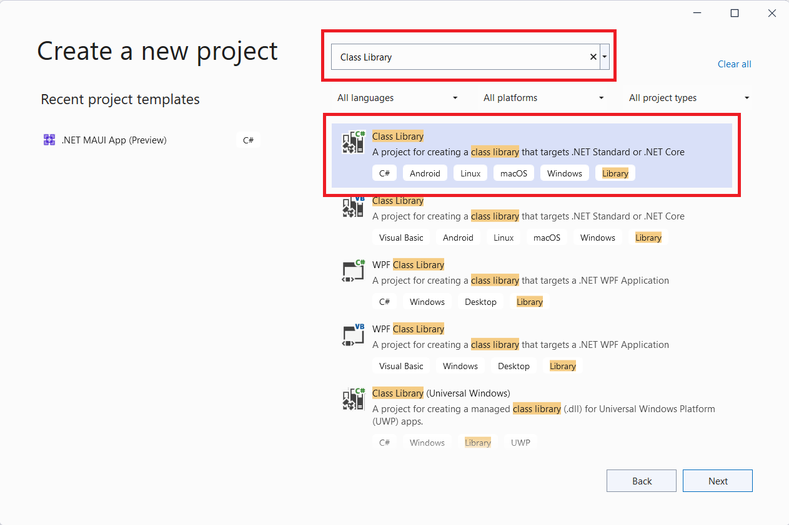

# A comprehensive introduction to Visual Studio, C# and the Hello World code
At the end of this tutorial you will have created and installed your own module that simply states: 'Hello World!' in the console. We will write a bit of C# (pronounce C-Sharp) code and learn about the basics of C# with regards to Gmod.NET module making.

**This tutorial is written for users who may not yet be familiar with coding outside of Garry's Mod Lua**. You could skip sections of the tutorial at your own discretion.


## Why?

**Because we can make Garry's Mod do more things.**

You can use Lua to automate a lot of cool stuff in Garry's Mod. Still there are restrictions to what we can do. For example we can't just connect to a MySQL database from Lua. To be able to do that we need to install a module.

Typically programmers can write modules with C++. Learning C++ and handling it the right way can be a challenge. C# is often described as being more accessible and the .NET Core Framework already comes with a lot of features. 

Furthermore there is tons of code already written for the .NET Core Framework. This means we can utilize that in our module to extend what Garry's Mod Lua can do.


## Requirements

* Windows 10 (8.1 and 7 SP1 may also work, see [Visual Studio requirements](https://docs.microsoft.com/en-us/visualstudio/releases/2019/system-requirements#visual-studio-2019-system-requirements))
* An internet connection
* A copy of [Garry's Mod installed through Steam](https://store.steampowered.com/app/4000/garrys_mod)
* Approximately 1 hour of your time and patience *(including downloading and installing Visual Studio)*


## Preparations

### Make sure you are on the Garry's Mod `x86-64` Beta branch

1. **In your Steam Library find Garry's Mod**

2. **Right click Garry's Mod and go to 'Properties...'**

   

3. **Click the Beta menu**

4. **From the dropdown select x86-64**

   

   

### Install Gmod.NET in Garry's Mod

Follow [the instructions in the README](https://github.com/GmodNET/GmodDotNet#installation-and-usage) and **double check the following is true:**

1. You have unpacked your [release of Gmod.NET](https://github.com/GmodNET/GmodDotNet/releases) to `garrysmod/lua/bin/` (create the `bin` folder if it does not yet exist)
2. You have created a Modules folder inside `garrysmod/lua/bin/`
3. Confirm your `garrysmod/lua/bin/` directory contains at least these files and folders:


4. You have copied `gmod-dot-net-lua-server.X.Y.Z.lua` to `garrysmod/lua/autorun/server/`

5. You have copied `gmod-dot-net-lua-client.X.Y.Z.lua`  to `garrysmod/lua/autorun/client/`


## Tutorial Overview

In this tutorial we'll take you through the process of creating a simple 'Hello World!' module. It will simply print 'Hello World!' to the console. The great thing about that is that you will have learnt the basics of creating a Gmod.NET module. We'll use **Visual Studio 2019**, **C#** (pronounce: C-Sharp) and the **.NET Core** (pronounce: dot net core) framework.

These are the subjects we will be discussing:

1. Configuring Visual Studio 2019 (aka "VS2019")
   * Where to download it from and installing VS2019
   * Ensuring the *.NET desktop development Workload* is installed
2. Creating a Gmod.NET module project
   * Choosing the project type *Class Library (.NET Core)*
   * Including the GmodNET.API *NuGet Package* into our project
3. Setting up the basic code structure
   * Implementing the GmodNET.API *IModule Interface*
4. Writing module code
   * Printing 'Hello World' to the console
5. Building, installing and testing our module
6. Recap and further reading
   * What is a *Visual Studio Solution* and how does it relate to a *Project*?
   * Where can we learn more on writing C# code?
   * What exactly is a *NuGet Package* and how can it help us?
   * Other tutorials on Gmod.NET


Now that you know what we're going to do and how we're going to get there: Let's get started!


## 1. Configuring Visual Studio 2019

*In short:* Visual Studio 2019 (aka VS2019) is an Integrated Development Environment (IDE). You can use it to write instructions for the computer in the form of code. Furthermore it contains all the tools you may need to debug the code, build the code to machine language, collaborate and much much more.

1. **Get Visual Studio 2019 Community from the official website:** https://visualstudio.microsoft.com/. The community edition is free for individual developers, open-source and academic purposes.

The installation should be self explanatory. Only make sure that you select the correct Workload: *.NET desktop development Workload*. We will need that to create a Garry's Mod .NET Module. 

2. **On the Workload selection screen in the installer choose at least the '.NET desktop development' Workload:**


Let's make sure we really have ALL required components.

3. **Go to Individual Components and ensure at least these components are checked:**

* .NET SDK
* NuGet Package manager
* C# and Visual Basic
* .NET Core 3.1 Runtime (LTS)


4. **Now click 'Install' at the bottom of the installer.**

You can always install other workloads later, so don't bother with anything else for now. You can find the Visual Studio Installer after the installation in your `(Windows Start Menu) > (All Programs) > Visual Studio 2019 > Visual Studio Installer`.

**That's it for now! Let's go to the next step: Creating our Gmod.NET module project**

*Confused? Stuck? Need more help? [This video contains a comprehensive guide in installing Visual Studio and starting it the first time](https://www.youtube.com/watch?v=G1-Zfr9-3zs).*


## 2.Creating a Gmod.NET module project

We've installed VS2019 and are ready to create our project. 

1. **Start VS2019**
2. ***(Only when starting VS for the first time)* You may be asked for some configuration options. You can choose all default settings or take your time to setup your environment:**
   * *Do you want to sign in?* Not required, but recommended to synchronize settings across your devices.
   * *Which Development Settings?* 'Visual C#' will fit best for the purpose of this tutorial
   * *Which color theme?* Pick any you like
   * After configuring our personal settings we should arrive at the start screen. 

You should see the start screen. You can recognize it by the big heading 'Visual Studio 2019' at the top. To the right should be 'Get started' with several options underneath it.

3. **Click the 'Create new project' option**

We now get to choose which type of project we want to create

4. **Click the project type *Class Library (.NET Core)*** (Use the search box to find it faster)

* **Note:** Is this project type missing? Double-check that you installed the .NET desktop development workload and required components mentioned in the previous chapter.
* **Beware:** There are similarly named project types that are incorrect! Do **NOT** choose Class Library (.NET Framework) or Class Library (.NET Standard). These are incompatible with Gmod.NET.



5. **Click Next** or double-click the project type

We now get to choose a name for our project. The rule we have for this is: no spaces, no special characters, EveryWordStartsWithACapitalLetter (known to programmers as PascalCase or UpperCamelCase).

6. **Choose the project name** `GmodHelloWorld`
7. **Take note of the location where the project is created.**

The solution name is the same as the project name by default. This is fine. We'll learn about the difference between projects and solutions later.

8. **Click Next** 

Visual Studio now asks which framework you wish to target. Gmod.NET requires at least .NET Core 3.1

9. **As the Target Framework choose '.NET Core 3.1 (Long-term support)'**

Visual Studio will generate a Class Library (.NET Core) project for us. When it's done you will see this screen:

 

Visual Studio helps us identify problems with our code. I have already enabled the Error List so I can see the errors and warnings Visual Studio gives. Errors always need to be fixed. Warnings can sometimes be ignored.

10. **Go to View and click 'Error List'**. This will help us later. You only have to do this once.

To keep the Error List in view you can click the little 'pin' icon in the top right.


In order to write Garry's Mod .NET modules we need to include the Gmod.NET API NuGet package. This adds code to our project so we don't have to write literally all code ourselves.

**Let's add the GmodNET.API NuGet package to our project.**

In Visual Studio we call the top menu (containing File, Edit, View, etc....) *the toolstrip*.

11. In the toolstrip **Go to Tools > NuGet Package Manager > Manage NuGet Packages for Solution...**


Through the NuGet package manager we can download and install all kinds of useful additions. Other programmers have graciously shared their projects with us, saving us from having to write all our own code.

12. **Go to the Browse tab**
13. In the search bar **search for GmodNET.API**
14. **Click GmodNET.API**
15. On the right-hand side **check the box in front of your project name (GmodHelloWorld)**
16. **Click Install**

By default the NuGet Package Manager will install the latest version into our project. It may take a second to download and install. You can see if Visual Studio is downloading something by looking at the bottom left of the program. It will say "Ready" when it's done doing whatever it's doing.

**We have now created an empty project with which we can start making Gmod.NET modules.** You will repeat this chapter every time you wish to create a new Garry's Mod module.


## 3. Setting up the basic code structure

Great! We've got the project setup. We want to get to writing some code. I'll have to bore you with some more *"things you always have to do"* though. Stick with me while we setup the code that will instruct Gmod.NET how to load our module.

**On the right hand side you see the 'Solution Explorer'** This contains our Solution, Project(s) and code files. We can also see what it "depends on" in Dependencies (NuGet Packages for example).

**Right now we have only a single code-file named Class1.cs (.cs stands for C-Sharp/C#). Let's clean up our code a bit and make it clear what it does.** 

1. **Right click Class1.cs in the Solution Explorer**

2. **Click Rename** and let's give this file a better name (read on below the image)

   

3. **We will name the file Setup.cs** since it will explain to Gmod.NET how our module starts, stops and what it does. I challenge you to think of a better name, though make sure that (like the project name) it is **always UpperCamelCase with no spaces, nor any special characters**. It always needs to end in **.cs** if you're writing C# code in it.

4. **Always click yes** when you get the dialog asking your something like "Would you like to rename all references from Class1 to Setup?". 

You should see the code on the left hand side change. Amongst other code it will now say `public class Setup` instead of `public class Class1`. It is always a good idea that the filename is the same as the class name. What a "class" is and what "public" stands for is outside the scope of this tutorial. At the end of this tutorial we'll refer you to some more tutorials on the C# programming language.

We've seen where we can navigate through our code in the Solution Explorer. We can see our code on the left-hand side. At the bottom of Visual Studio we even see a nice empty Error List (hopefully).

**We will now write our first code, instructing Gmod.NET that this code file is a module.**

**Note:** Follow along carefully! Like in Garry's Mod Lua a single incorrect character can cause problems. Furthermore in C# you need to write code in exactly the right place. Everything in C# is inside a class and a class is usually inside a namespace. Always within the correct **curly brackets**: { and }.

5. **Put your cursor behind `public class Setup` and type: ` : IModule`**

Check that you've written the code exactly (with a capital I and capital M) like in this screenshot:


😱 Oh no! We've got an error! Well at least we know the Error List works. It tells us that IModule can't be found. We even get a red curly line under the text IModule and if we hover over it with our cursor we see the error again.

Errors aren't something to be afraid of. In fact they will happen all the time while we're writing code. Usually they're very clear in what's wrong and give us information to work with. The only downside is: we don't know all the ins-and-outs of programming in C# yet. So every error looks like it's written in a foreign language we don't speak. Give yourself enough time to learn what the errors mean and how to correct them.

**Incredibly Visual Studio thinks it can even help us with this error. It's saying 'Show potential fixes' and in this case one of the suggestions actually makes sense.**

6. **Click 'Show potential fixes'**

7. Now click the top option **using GmodNET.API;**

   **Note:** If this option is missing then you skipped installing the GmodNET.API NuGet package in the previous chapter, or it failed to install somehow.


**Note:** You can't always just go and click an option that Visual Studio recommends. Sometimes it gives terrible suggestions and the bottom three suggestions (Generate interface [...], Generate new type, etc.) almost always appear.

**The suggestion to add `using GmodNET.API;` added that same line of code to the top of our file. The name IModule turned a different color as well.** With that line of code we explained to Visual Studio that we understand that IModule is not part of default C#. We tell it to go look for additional code in the GmodNET.API "namespace". There's code in GmodNET.API that explains what IModule is and how it works. Therefor the error we had disappears. C# now knows what to do with IModule.

**Additionally we've now got 4 new errors. Yay! Information:**


**IModule is an "interface". An interface forces us to add certain functionalities to our class.** IModule forces us to add functionalities explaining how the module must start and stop.

Since we don't have those functionalities Visual Studio righteously complains by giving us errors. Let's add the missing functionalities.

**Let Visual Studio help us *implement the interface*** (= to add the functionalities that the interface wants us to add):

8. **Hover your cursor over the error at IModule**
9. **Select 'Show potential fixes'**
10. **Choose the suggestion 'Implement interface'**


With those few clicks VS has gone and generated a ton of code for us. I even had to resize the panels inside Visual Studio a bit and zoom out on the code so all of it fits in the next screenshot:


**All errors are gone now!**

The generated code shows us how we can implement our interface. The clear names for these functionalities also show us what we need to do and how we need to fill it in.

**Let's go over the generated code, step-by-step and fill in the "empty spots".**

11. First we have the *Property* `ModuleName` which is of the type *string*. **Adjust the code like so:**

    

**A *Property* describes a class (plural**. In this case the `ModuleName` describes what the name of our module will be. This property is of the type *string*. **Properties with the type string can only contain text. We can write literal text by using "double quotation marks".**

**You can compare Properties to variables in Lua.** Only a property is a variable that is tied to the class it is in. 

In this case our property can be *accessed from the outside* by other classes and even other applications. This is because we made it *public*. We need these properties to be public because Gmod.NET can look at these values later when it loads our module.

The next property is called `ModuleVersion` and is also of the type string. In the exact same way you wrote the code for ModuleName you should now write the code for the version of your module. 

12. **Set ModuleVersion to the version number: 0.1.0** (Make sure you use the symbols we just discussed to indicate it's a literal string)

Those were the only properties. Next up we get the place where we will write code that instructs the computer (or Garry's Mod in this case) to do something.

If we skim the rest of the code we see (amongst a lot of other code) the words Load and Unload. **Load and Unload are 'Methods'. **

**Methods explain to the computer in what sequence actions need to be performed. You can somewhat compare Methods to Lua functions.**

Methods sometimes get input and they sometimes return output. We can see that the Load and Unload methods don't return any output from the keyword `void` in front of the Method name. 

We can see from the () behind the Unload method that it does not expect any arguments and therefor has no input. 

**Load is called when our module is loaded.** We will fill it with code in the next chapter.

**Unload is called when our module needs to cleanup after itself.** Unload is irrelevant for our Hello World example.

13. **Remove `throw new NotImplementedException();`** from both the Load and Unload methods:


**To summarize what we've learnt:**

* Errors help us identify problems
* By putting `: IModule` behind our class name we can make it a Gmod.NET module
* In order to use the IModule interface we have to add a line of code starting with "using" at the top of the file.
* Visual Studio can help us fix some errors, but not all.
* Visual Studio can help us generate the functionalities IModule requires: implementing the IModule interface
* Properties describe a class
* Methods explain in what sequence code needs to be executed


**That's it! We've setup our code and are ready to get to the main subject of today: making our module print 'Hello World!'.**


## 4. Writing module code

After all those instructions we finally get to the most important part of this module: actually printing 'Hello World!' to the Garry's Mod console. Hilariously this will be the shortest chapter of all.

1. We'll explain a bit of the code below in a moment. First **copy the following code inside the Load method between the curly brackets:**

   ```lua
   lua.PushSpecial(GmodNET.API.SPECIAL_TABLES.SPECIAL_GLOB);
   lua.GetField(-1, "print");
   lua.PushString("Hello World!");
   lua.MCall(1, 0);
   lua.Pop(1);
   ```

Confirm the entire code file `Setup.cs` looks like this:


The code we just added to the Load method will be executed when Gmod.NET loads our module. The code simply prints the string "Hello World!" to the Garry's Mod console. We use the Lua `print` function to achieve this.

**You can take the code you just copied for granted and skip to the next chapter to build, install and test your module. Come back when you're ready to have the code explained to you.**


### The Hello World code explained

The Hello World code we copied looks overly complex if we just want to print a string. Especially if you consider that in Lua it takes only: `print("Hello World!")` and you're done. The difference is Lua uses what is called a "Stack" to communicate values between Lua and the C-programming language (in our case C#). This may feel a bit weird at first, but you'll get used to it.

You can imagine the Lua *Stack* exactly like what it implies. A stack of things: you can only put something on top and take something of the top. Don't try and pull something out halfway or from the bottom or everything falls over/breaks.


#### The Load method and its arguments

First we see by the `void` indicator in front of the Load method that it returns no value. Load gives no output.

We can see that the Load method receives a few arguments of input:

* We have 4 arguments that Gmod.NET will fill for us. Each argument is basically a variable. Each variable has a type.
* `ILua lua`:
  * The first argument is of type `ILua` and is named `lua`
  * We can use this argument inside the method by writing `lua.` and then something to do with it.
  * This argument is filled with the Garry's Mod *Lua State*. It is what makes Lua work and we can use it to add variables to Lua, call Lua functions and more.
* `bool is_serverside`
  * The second argument is of type `bool` and is named `is_serverside`
  * A bool is short for boolean. It can contain only `true` or `false`.
  * We often use booleans for yes/no or on/off questions.
  * This argument is true if the module was loaded serverside.
* `GetILuaFromLuaStatePointer lua_extructor` - Irrelevant for beginners, ignore it for now.
* `ModuleAssemblyLoadContext assembly_context` - Irrelevant for beginners, ignore it for now.


#### The Load method's body

We call the code inside a method it's body. The code we added will print "Hello World!".

**This is what each line of code does:**

* `lua.PushSpecial(GmodNET.API.SPECIAL_TABLES.SPECIAL_GLOB);`
  * This is a method on the Lua State that puts something "special" on top of the Stack. 
  * We give it `GmodNET.API.SPECIAL_TABLES.SPECIAL_GLOB` to let the PushSpecial method know we want to put the "Global Table" on top of the stack.
  * In Lua the Global Table lives in the `_G` variable (we'll use that name for the Global Table from hereon)
  * It will become clear why we do this in a moment.
  * Our stack (contains 1 thing) looks like this now:
    * `_G`
* ``lua.GetField(-1, "print");`
  * This is a method on the Lua State that gets the value of a field from a table. It then pushes that onto the stack
  * We give it -1 to indicate to look down one spot on the stack for the table. -1 from the top of the stack is the Global Table (_G) that we just pushed onto the stack.
  * In Lua the print function lives in the global table (that's why you can use it everywhere in your Lua code)
  * Our stack (contains 2 things) now looks like this:
    * `print`
    * `_G` *(notice how the stack builds from the bottom to the top)*
* `lua.PushString("Hello World!");`
  * Now we tell Lua to push the string "Hello World!" onto the stack.
  * Our stack (contains 3 things) now looks like this:
    * `"Hello World!"`
    * `print`
    * `_G`
* `lua.MCall(1, 0);`
  * With the `MCall` method we tell Lua to call the stack as if it's a function.
  * We give it 1 as the first argument to indicate that only the last thing thing on the stack ("Hello World!") is the argument.
  * We give it 0 as the second argument to let Lua know that we don't care about the output of the function (the print function doesn't return anything anyway)
  * At this point the computer basically knows: *from the global table get the field print and call it with the string "Hello World!"*. 
  * In Lua this would be: `_G.print("Hello World!")`
  * When you call a function using `lua.MCall` it will remove the arguments and function from the stack for you.
  * Our stack (contains 1 thing) looks like this now:
    * `_G` *(Take note that in this case MCall will not remove the global table)*
* `lua.Pop(1);`
  * Removes thing(s) from the top of the stack.
  * We give it 1 to indicate we want to remove 1 thing from the top. In this case it removes the global table _G.
  * Our stack now contains nothing.
  * You should strive to always know what is on the stack. Don't just leave stuff in it, but pop it when you're done with it.


##5. Building, installing and testing our module

TODO: Building info


TODO: Finding solution location in File Explorer


TODO: Solution structure explained


TODO: GmodHelloWorld\GmodHelloWorld\bin\Debug\netcoreapp3.1


TODO: Installing (same folder name)


TODO: Open Garry's Mod start a singleplayer game and check console. Yellow because Singleplayer

 


TODO: If you try to remove or replace the module (because you've made changes for example):


TODO: Then reload with `gmod_net_unload_all`  for server but in our case`gmod_net_unload_all_cl` for clientside because singleplayer


## 6. Recap and further reading (TODO)

* What is a *Visual Studio Solution* and how does it relate to a *Project*?
* Where can we learn more on writing C# code?
* What exactly is a *NuGet Package* and how can it help us?
* Other tutorials on Gmod.NET

